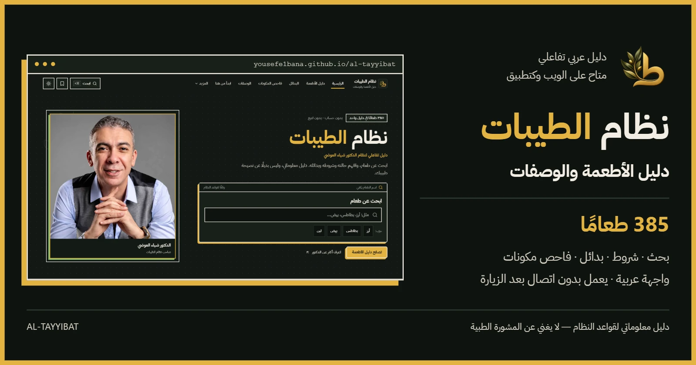
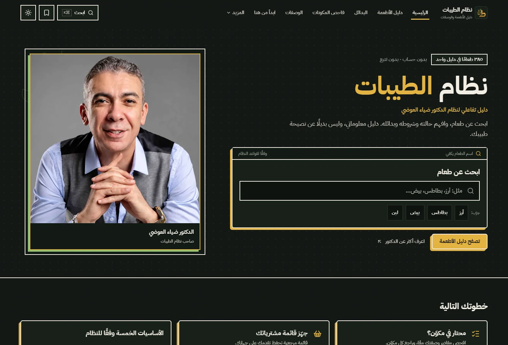
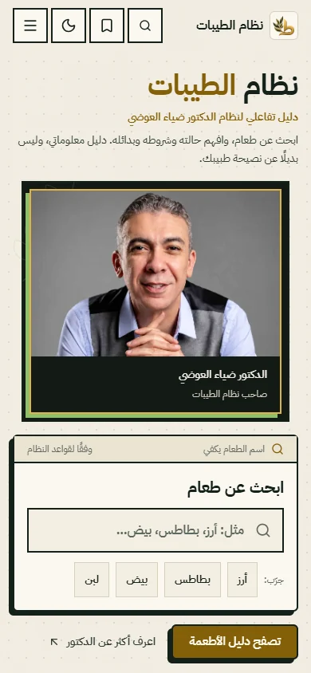
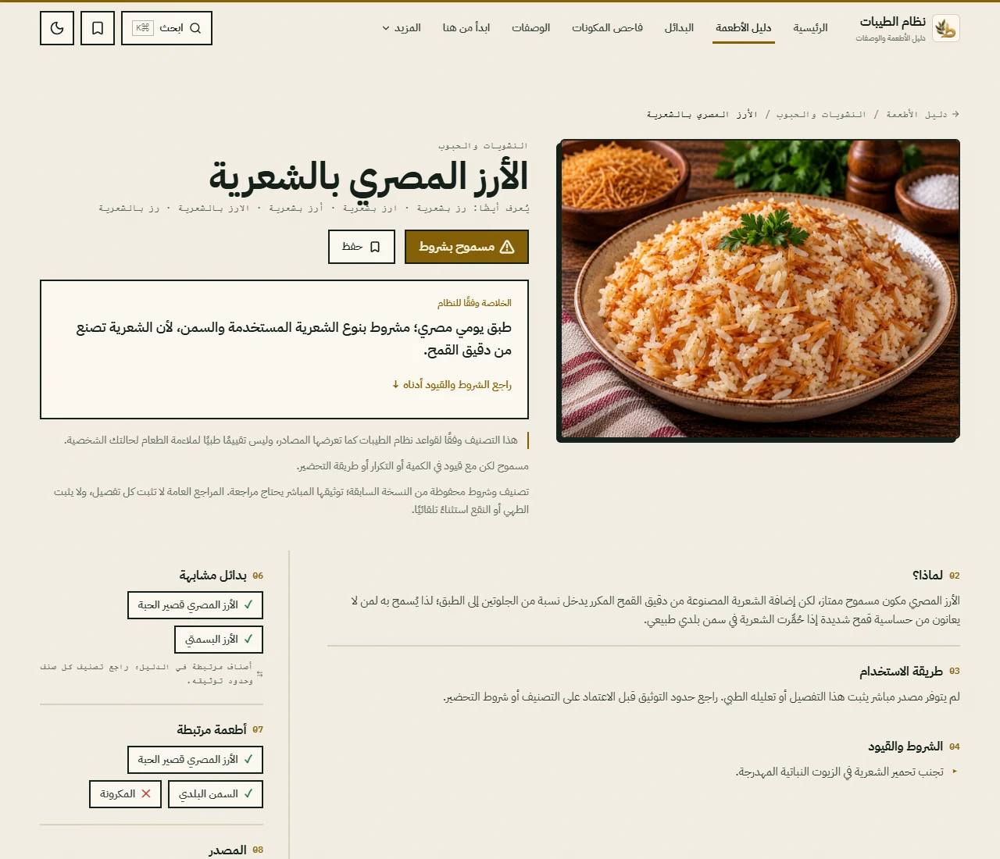
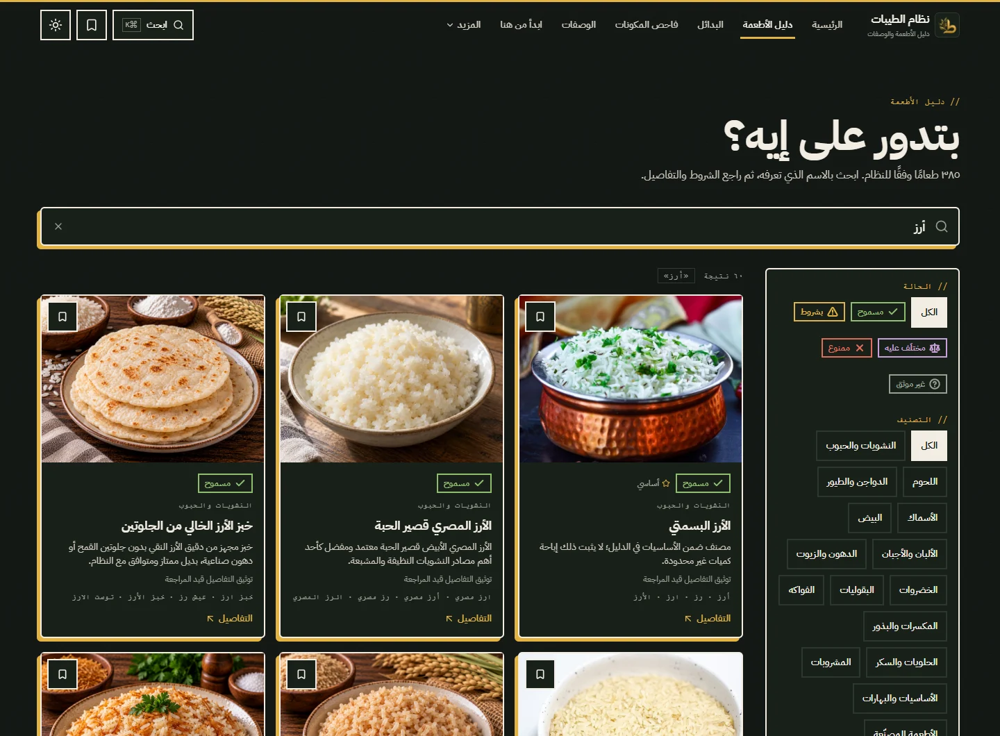
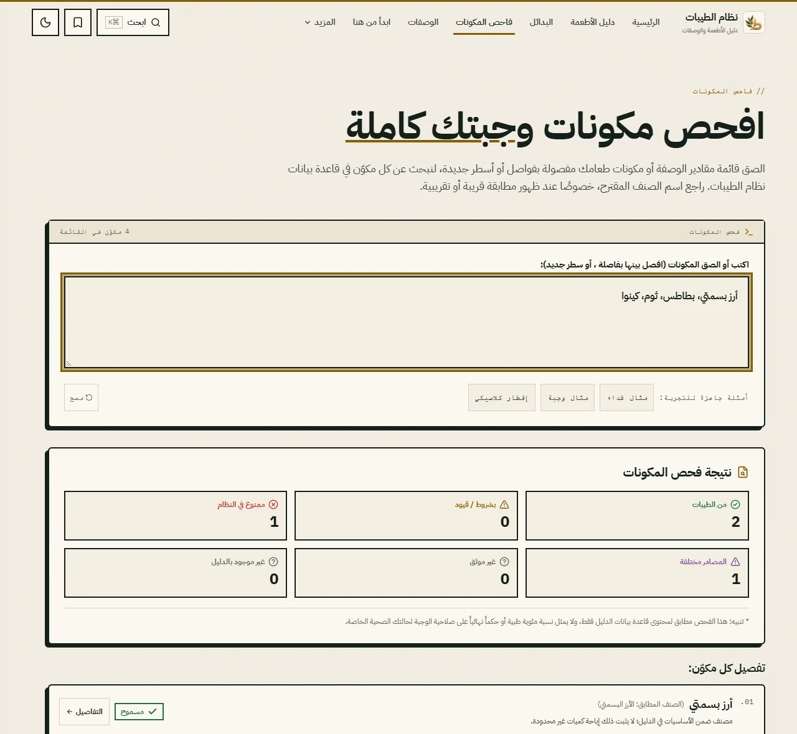
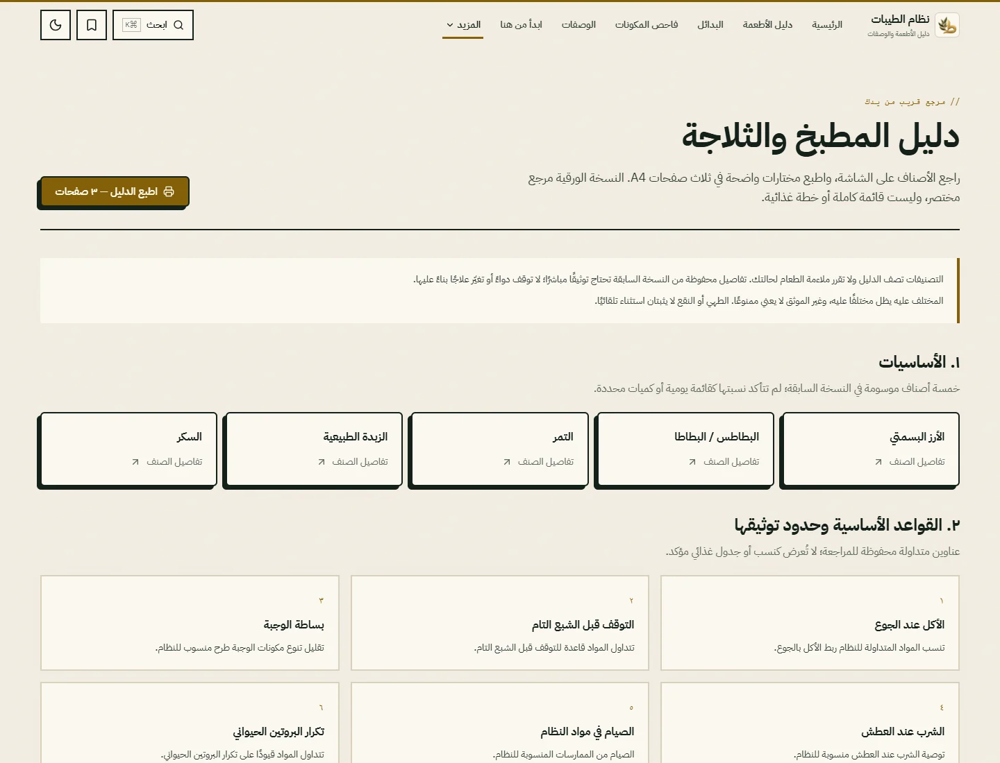
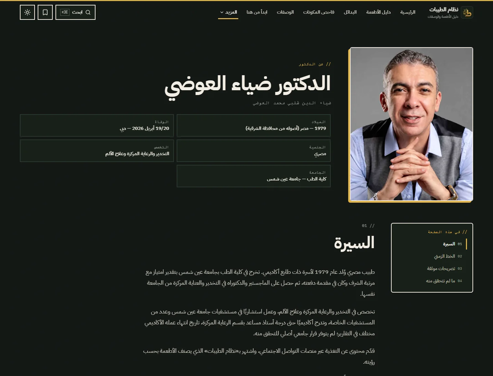

<p align="center">
  
</p>

<h1 align="center" dir="rtl">نظام الطيبات · Al-Tayyibat</h1>

<p align="center" dir="rtl">
  دليل عربي تفاعلي لنظام الدكتور ضياء العوضي.<br>
  ابحث في <strong>385 طعامًا</strong>، افهم التصنيف والشروط، واكتشف البدائل والوصفات في واجهة تناسب هاتفك ومطبخك.
</p>

<p align="center" dir="ltr">
  <a href="https://yousefe1bana.github.io/al-tayyibat/"><strong>فتح الموقع ↗</strong></a>
  &nbsp; · &nbsp;
  <a href="https://github.com/YousefE1bana/al-tayyibat/releases/tag/v1.0.0"><strong>v1.0.0 Release</strong></a>
  &nbsp; · &nbsp;
  <a href="https://github.com/YousefE1bana"><strong>Yousef Elbana · GitHub</strong></a>
</p>



## جولة في الدليل

لقطات من [الموقع المنشور](https://yousefe1bana.github.io/al-tayyibat/)، بالمظهرين الداكن والفاتح. اضغط على أي صورة لعرضها بحجمها الكامل.

[](docs/readme/desktop-home.webp)

<table>
  <tr>
    <td align="center" width="50%">
      <strong>الواجهة على الهاتف</strong><br><br>
      <a href="docs/readme/mobile-home.webp"></a>
    </td>
    <td align="center" width="50%">
      <strong>تفاصيل الطعام وشروطه</strong><br><br>
      <a href="docs/readme/food-detail.webp"></a>
    </td>
  </tr>
  <tr>
    <td align="center">
      <strong>البحث العربي والتصفية</strong><br><br>
      <a href="docs/readme/search.webp"></a>
    </td>
    <td align="center">
      <strong>فاحص المكونات</strong><br><br>
      <a href="docs/readme/ingredient-checker.webp"></a>
    </td>
  </tr>
  <tr>
    <td align="center">
      <strong>دليل المطبخ والثلاجة</strong><br><br>
      <a href="docs/readme/kitchen-guide.webp"></a>
    </td>
    <td align="center">
      <strong>التعرّف إلى الدكتور</strong><br><br>
      <a href="docs/readme/doctor-page.webp"></a>
    </td>
  </tr>
</table>

## ماذا يقدم الدليل؟

- **385 طعامًا:** بحث عربي بالاسم والأسماء البديلة، وتصفية بحسب الفئة والتصنيف.
- **تفاصيل تساعدك على القراءة:** وصف الطعام، الشروط، إرشادات التحضير، البدائل والأطعمة المرتبطة، مع الإسناد وحدود التوثيق.
- **فاحص مكونات ووصفات:** الصق قائمة مكونات وجبتك وراجع المطابقات؛ تصفح الوصفات واقرأ ملاحظاتها التحريرية.
- **أدوات يومية:** احفظ المفضلة وأنشئ قائمة مشتريات على جهازك.
- **مرجع للمطبخ:** دليل سريع قابل للطباعة في ثلاث صفحات A4، وصفحة للدكتور وسياق النظام.
- **واجهة عربية مرنة:** RTL، مظهر فاتح وداكن، ودعم الهاتف والكمبيوتر مع احترام تفضيل تقليل الحركة.
- **دليل قابل للتثبيت والاستخدام دون اتصال:** PWA مع بيانات عامة قابلة للقراءة آليًا لأنظمة الذكاء الاصطناعي والأدوات الآلية.

## كيف تستخدمه؟

1. افتح [الدليل](https://yousefe1bana.github.io/al-tayyibat/) وابحث عن اسم الطعام أو تصفح الفئات.
2. افتح تفاصيل الصنف؛ اقرأ التصنيف **والشروط وحدود التوثيق** معًا.
3. لوجبة متعددة المكونات، استخدم [فاحص المكونات](https://yousefe1bana.github.io/al-tayyibat/#/ingredients) وراجع الأسماء المقترحة.
4. استكشف البدائل والوصفات، ثم احفظ ما تحتاجه في المفضلة أو قائمة المشتريات.
5. اطبع [دليل المطبخ](https://yousefe1bana.github.io/al-tayyibat/#/print)، أو ثبّت الموقع للوصول إليه كتطبيق.

## تصنيفات الطعام

هذه تصنيفات **داخل نظام الطيبات**، وليست أحكامًا طبية عامة.

| التصنيف | العدد | طريقة القراءة |
| --- | ---: | --- |
| مسموح — من الطيبات | **116** | مدرج ضمن المسموح بحسب النظام؛ راجع تفاصيل الصنف. |
| مسموح بشروط | **103** | الإباحة مرتبطة بشروط أو طريقة تحضير؛ لا تتجاوز نص الشرط. |
| ممنوع في النظام | **157** | غير موصى به بحسب قواعد النظام. |
| مختلَف عليه | **4** | المصادر مختلفة؛ لا يُختزل إلى مسموح أو ممنوع. |
| غير موثق | **5** | المعلومات المتاحة لا تكفي لحسم التصنيف؛ غير موثق لا يعني ممنوعًا. |
| **الإجمالي** | **385** | |

## تطبيق قابل للتثبيت · PWA / Offline

تظهر دعوة تثبيت صغيرة عندما يتيح المتصفح ذلك، ويبقى خيار **«ثبّت الدليل»** متاحًا في التذييل. على Android وChromium المكتبي يستخدم الدليل طلب التثبيت الأصلي؛ على iPhone وiPad يعرض إرشادات **مشاركة ← إضافة إلى الشاشة الرئيسية**. تختفي أدوات التثبيت عند تشغيله كتطبيق مستقل.

بعد زيارة ناجحة عبر الإنترنت، تتوفر الواجهة والكتالوج والبحث وتفاصيل الأطعمة والفئات والمفضلة وقائمة المشتريات دون اتصال. تُخزّن صور الأطعمة التي شاهدتها مؤخرًا ضمن ذاكرة مؤقتة محدودة؛ **ليست كل الصور متاحة دون اتصال**، وتظهر حالة بديلة للصور غير المحفوظة.

عند توفر إصدار أحدث، يعرض التطبيق **«يتوفر تحديث جديد»** ويترك قرار التحديث لك. لا يعيد تحميل الصفحة تلقائيًا أثناء استخدامك لها. **الإشعارات وWeb Push ليست ضمن v1.0.0.**

## الخصوصية

- لا حسابات، ولا تحليلات استخدام، ولا تتبع.
- المفضلة وقائمة المشتريات محفوظتان محليًا على جهازك.
- لا يوجد backend لبيانات المستخدم، ولا تُرسل القوائم المحفوظة إلى خادم.
- لا يحتاج تشغيل الدليل إلى خدمة مدفوعة: **0 EGP / لا خدمات تشغيل مدفوعة**.

## تنبيه طبي وتحريري

> يوثّق هذا الموقع نظام الطيبات المرتبط بالدكتور ضياء العوضي ويصف قواعده؛ لا يثبت ادعاءاته الصحية كحقائق علمية أو طبية، ولا يقدم نصيحة طبية شخصية. استشر مختصًا قبل اتخاذ قرارات طبية أو تغيير علاج أو نظام غذائي مرتبط بحالة صحية.

تُقرأ العبارات الخاصة بالنظام بصيغة **«وفقًا لنظام الطيبات…»** أو **«بحسب قواعد النظام…»**. تبقى المسائل المختلف عليها وغير الموثقة كذلك. بعض الوصفات اقتراحات تحريرية موضح سياقها داخل الدليل؛ لا تُنسب تلقائيًا إلى الدكتور. الموقع دليل معلوماتي مستقل.

---

## التقنيات

React 19 · TypeScript · Vite 7 · Tailwind CSS 4 · Framer Motion · React Router **HashRouter** · Radix UI · Lucide · Fuse.js · Workbox / vite-plugin-pwa.

الاستضافة الحالية **GitHub Pages**. تستخدم الهوية خطّي **IBM Plex Sans Arabic / Mono**، وألوان الذهب والزيتون والكريمي، مع حدود واضحة وظلال مزاحة. الخطوط والصور محلية.

### موارد عامة للقراءة الآلية

- [llms.txt](https://yousefe1bana.github.io/al-tayyibat/llms.txt): وصف المشروع وحدود تفسير المحتوى؛ اصطلاح ناشئ، وليس معيارًا عالميًا مضمونًا.
- [كتالوج الأطعمة JSON](https://yousefe1bana.github.io/al-tayyibat/data/foods.json).
- [دليل النظام JSON](https://yousefe1bana.github.io/al-tayyibat/data/system-guide.json).
- [فهرس الأطعمة والروابط](https://yousefe1bana.github.io/al-tayyibat/ai/catalog-index.json).

تُولّد هذه الملفات من بيانات TypeScript المستخدمة في التطبيق بواسطة `scripts/generate-ai-assets.ts`؛ لا يوجد كتالوج ثانٍ يُحرر يدويًا. تبقى الادعاءات منسوبة إلى مصادرها، والشكوك موضحة عند الاستهلاك الآلي أيضًا.

## التطوير المحلي

المتطلبات: **Node.js ≥22.12** وnpm. تستخدم بيئة CI إصدار Node.js 24.

```bash
npm ci
npm run dev
```

العنوان الافتراضي: `http://localhost:5173/al-tayyibat/`.

```bash
npm run typecheck
npm run validate
npm run build
npm run preview
```

يولّد `prebuild` ملفات الذكاء الاصطناعي وأيقونات PWA؛ يفحص `postbuild` مخرجات PWA. البناء النهائي في `dist/`، والمسار الأساسي `/al-tayyibat/`. حافظ على HashRouter وروابط `#/` حتى تعمل الروابط المباشرة على GitHub Pages.

## التحقق وQA

| الأمر | ما يفحصه |
| --- | --- |
| `npm run typecheck` | أنواع التطبيق وservice worker. |
| `npm run validate` | ثوابت الكتالوج والمحتوى والصور والبحث وملفات AI وPWA والمراجعة التحريرية. |
| `npm run build` | بناء الإنتاج وتوليد الأصول وفحص PWA المبني. |
| `npm run qa:browser` | المسارات والتفاعلات وإتاحة الوصول والتجاوب والهوية وPWA والطباعة وفحوص الإصدار على المتصفح. |

لفحص المتصفح، شغّل البناء ثم خادم المعاينة في نافذة طرفية منفصلة:

```bash
npm run preview -- --host 127.0.0.1 --port 4173
```

ثم شغّل `npm run qa:browser`. تستخدم السكربتات **Google Chrome المثبت على الجهاز**؛ العنوان الافتراضي للفحص هو `http://127.0.0.1:4173/al-tayyibat/` ويمكن تغييره عبر `QA_BASE_URL`. تشمل الفحوص المستهدفة عروض الهاتف **320 / 360 / 375 / 390 / 430**، والكمبيوتر حتى **1920**، والمظهرين وتقليل الحركة والطباعة A4. تُحفظ التقارير واللقطات المؤقتة في `output/` المستبعد من Git.

لإعادة توليد المعاينة الاجتماعية من الواجهة الفعلية بعد تشغيل المعاينة:

```bash
node scripts/social-preview.mjs
```

يضيف `--readme-hero` توليد `docs/readme/hero.webp`. أما لقطات README فهي لقطات فعلية من الموقع المنشور، محسّنة بصيغة WebP.

لا تغيّر بيانات الطعام أو مصادره لمجرد تحسين العرض. راجع [المراجعة التحريرية والمسائل غير المحسومة](docs/editorial-review.md) قبل تعديل المحتوى. يحمي `docs/catalog-baseline.json` النسخة المراجعة، ويحمي مدقق الصور الأصول الأصلية للدكتور.

## بنية المشروع

```text
src/components/     العناصر المشتركة وهيكل الواجهة
src/config/         الهوية وأصول الدكتور وروابط المطوّر
src/features/       البحث والأطعمة والوصفات والمظهر وPWA
src/pages/          صفحات الدليل وأدواته والطباعة
src/data/           الكتالوج والقواعد والمراجع
src/hooks/          التخزين المحلي والبيانات المشتركة
src/lib/            البحث والحالات والحركة والتحقق
public/             الصور والخطوط وملفات AI وأيقونات التطبيق
assets/             نسخ الأصول المعتمدة والمحفوظة
scripts/            التوليد والمدققات وفحوص المتصفح
docs/readme/        صور عرض المستودع
docs/               الهوية والمراجعة التحريرية وثوابت المحتوى
.github/workflows/  التحقق والنشر على GitHub Pages
```

الدفع إلى `main` يشغّل workflow **Validate and deploy** للتحقق والبناء والنشر. تتوفر تفاصيل صيانة الهوية في [docs/branding.md](docs/branding.md).

## الإصدار المستقر

**[Al-Tayyibat v1.0.0 — أول إصدار عام مستقر](https://github.com/YousefE1bana/al-tayyibat/releases/tag/v1.0.0)**

يشمل الدليل التفاعلي والهوية المعتمدة والطباعة والتثبيت والاستخدام دون اتصال والملفات العامة القابلة للقراءة آليًا. الإشعارات وWeb Push غير متاحة في هذا الإصدار.

## التطوير والصيانة

**Yousef Elbana**

[GitHub](https://github.com/YousefE1bana) · [LinkedIn](https://www.linkedin.com/in/yousefelbana) · [المستودع](https://github.com/YousefE1bana/al-tayyibat) · [الموقع](https://yousefe1bana.github.io/al-tayyibat/)
