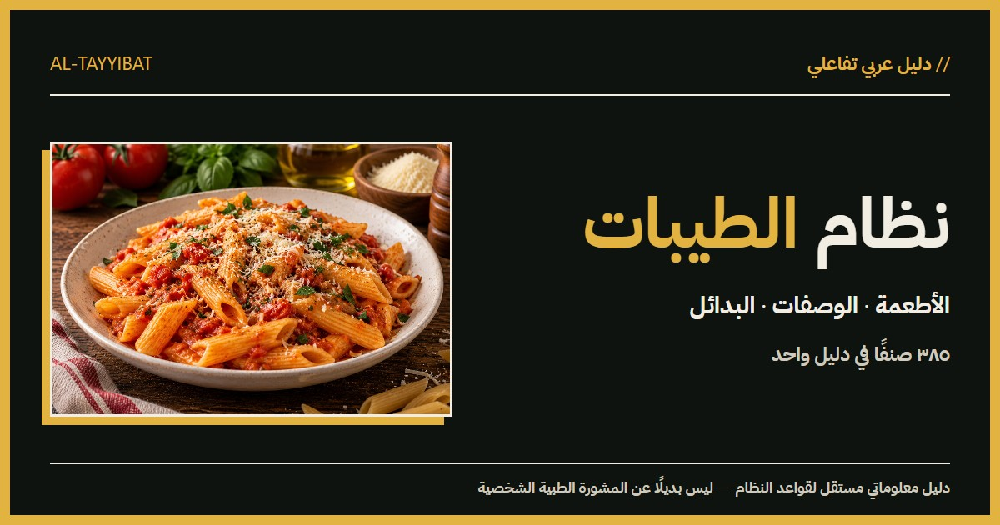

# نظام الطيبات · Al-Tayyibat

دليل معلوماتي عربي مستقل لعرض قواعد نظام الطيبات للدكتور ضياء العوضي، مع البحث في **385 طعامًا**، التصنيفات والقيود والمصادر، البدائل، فاحص المكونات، الوصفات، المحفوظات، قائمة المشتريات والطباعة. واجهة RTL محلية البيانات، بمظهرين فاتح وداكن.

> التصنيفات تعرض ما تقوله مصادر النظام؛ لا تثبت صحة ادعاءاته العلمية ولا تُعد نصيحة طبية شخصية. يُرجى استشارة مختص قبل تغيير علاج أو نظام غذائي لحالة صحية.

[الموقع العام](https://yousefe1bana.github.io/al-tayyibat/) · [تقرير الجاهزية](docs/production-readiness.md) · [ملاحظات المحتوى](docs/content-observations.md)



## التشغيل

استخدم Node.js 24 LTS (أو إصدارًا متوافقًا ≥22.12):

```bash
npm install
npm run dev
```

افتح العنوان الذي يعرضه Vite؛ المسار الافتراضي هو `http://localhost:5173/al-tayyibat/`. يتوفر `start.bat` للتشغيل على Windows. للتثبيت المطابق لملف الاعتماديات في CI استخدم `npm ci`.

```bash
npx tsc --noEmit
npm run validate
npm run build
npm run preview
```

البناء ينتج `dist/` مع ملفات JavaScript وCSS منفصلة ومسارات صفحات تُحمّل عند الحاجة. يجب تقديم البناء عبر HTTP؛ فتح `index.html` من القرص مباشرة لا يدعم وحدات ES في المتصفح.

## التحقق

| الأمر | التحقق |
| --- | --- |
| `npm run typecheck` | TypeScript strict |
| `npm run validate:content` | أعداد الحالات الثابتة، IDs/slugs، الفئات، البدائل، الأطعمة المرتبطة، الوصفات والمصادر |
| `npm run validate:images` | الملفات المحلية، الأسماء القياسية، JPEG 1200×900، الصور المكررة، سلامة صورة الدكتور |
| `npm run validate:search` | البحث العربي والتطبيع والنتائج ومجموعة 385 اسمًا |
| `npm run validate` | المدققات الثلاثة السابقة |
| `npm run qa:browser` | Chrome حقيقي، 390 و1440، المظهران، المسارات والتفاعلات وaxe |

لـ QA شغّل `npm run build` و`npm run preview -- --host 127.0.0.1 --port 4173` أولًا. يحتاج الاختبار إلى Google Chrome؛ لاستخدام Chromium الخاص بـ Playwright يمكن تعديل خيار `channel` في السكربت. لتغيير الهدف استخدم `QA_BASE_URL`، مثل عنوان الموقع المنشور. تحفظ التقارير واللقطات في `output/playwright/release/` المستبعد من Git.

ثوابت الكتالوج: **116 compatible / 103 conditional / 157 notRecommended / 4 disputed / 5 unknown**. لا تغيّر هذه الأرقام أو معنى القواعد ضمن تحسينات العرض. نجاح التحقق البنيوي لا يحل التناقضات الدلالية المسجلة في ملاحظات المحتوى.

## التقنية والبنية

React 19 · TypeScript strict · Vite 7 · Tailwind 4 · Framer Motion · Radix UI · Lucide · Fuse.js · React Router HashRouter.

```text
src/components/     هيكل الصفحات وعناصر الواجهة المشتركة
src/features/       الأطعمة والبحث والوصفات والمصادر والمظهر
src/pages/          صفحات الموقع، الطباعة و404
src/data/           بيانات TypeScript المحلية ومراجع الصور
src/hooks/          التخزين المحلي والمجموعات وبيانات الصفحة
src/lib/            البحث العربي والحالات والحركة والتحقق
public/images/      الصور المحلية
public/fonts/       خطوط IBM Plex المحلية
scripts/            التحقق وQA وتدقيق/ترحيل الصور
docs/               الجاهزية والمحتوى وسجل الصور
.github/workflows/  CI والنشر
```

لا يوجد backend أو تسجيل دخول أو قاعدة بيانات سحابية. المحفوظات والمظهر والمشتريات تحفظ على جهاز الزائر في `localStorage`؛ يبقى الموقع قابلًا للاستخدام عند تعذر التخزين. البيانات لا تُرسل إلى خادم.

## النشر المجاني

الخيار المعتمد **GitHub Pages**؛ جميع الموارد محلية وHashRouter يعمل دون قواعد إعادة كتابة. الدفع إلى `main` يشغّل `.github/workflows/release.yml`: تثبيت حتمي، TypeScript، تحقق المحتوى/الصور/البحث، بناء ثم نشر Pages. طلبات السحب تتحقق دون نشر.

من إعدادات المستودع اختر **Pages → Source → GitHub Actions**. الموقع المستهدف: `https://yousefe1bana.github.io/al-tayyibat/`. قيمة Vite الافتراضية `base: /al-tayyibat/` ويستخدمها مساعد مسارات الصور. روابط الصفحات مثل `#/foods/pasta` تبقى صالحة عند التحديث.

لنطاق جذر مختلف، اضبط `VITE_BASE_PATH=/` وقت البناء، وحدّث canonical وOG وrobots وsitemap للعنوان الفعلي. بدائل الاستضافة: Vercel أو Cloudflare Pages، أمر البناء `npm run build` ومجلد الناتج `dist`؛ HashRouter لا يحتاج SPA rewrite. لا يتطلب الموقع ميزة مدفوعة أو سرًا في CI.

SEO في هذا الإصدار يوفّر بيانات الصفحة الرئيسية وsocial preview وcanonical واحدًا. روابط hash ليست صفحات مستقلة في sitemap؛ لا يدّعي المشروع فهرسة كاملة لكل طعام دون prerendering.

## المحتوى والصور

المصادر مسجلة في `src/data/sources.ts` مع نوع المصدر وملاحظات موثوقيته. الادعاءات تُنسب إلى النظام أو صاحبها، ولا تُعاد صياغتها كحقائق طبية ثابتة. أي تغيير في القواعد أو التصنيفات يحتاج مراجعة محتوى مستقلة ومصدرًا واضحًا.

صور الطعام ملفات محلية مستقلة لكل طعام، باسم `public/images/foods/<food-id>.jpg`، بنسبة 4:3 ومقاس 1200×900. استُخدمت الصور المحلية المقدمة وصور مولّدة منفردة بعد المراجعة البصرية؛ الصور توضيحية ولا تثبت التركيب أو بلد المنشأ أو أسلوب تربية الحيوان. لا يعتمد التشغيل على صور stock بعيدة، ولا نضيف ادعاء ترخيص بلا سجل موثق.

سجل الترحيل والمراجعة في `docs/image-migration.json` و`docs/generated-image-review.json`؛ الحالة الفعلية والطلبات المتبقية في `docs/image-generation-manifest.json` و`docs/image-generation-queue.md`. أصول `newasset/` و`output/imagegen/` تبقى محليًا وتُستبعد من Git، ولا تُحذف قبل تحقق الترحيل.

**صورة الدكتور المقدمة محمية:** لا تولّد أو تعدّل `public/images/doctor/portrait.jpg`. المدقق يراجع بصمتها. عند تعذر صورة يعرض الموقع بديلًا واضحًا بدل صورة مكسورة.

الهوية: Retro Neo-Brutalism + Terminal Editorial، حدود صلبة وظلال مزاحة وألوان عضوية دافئة وخط IBM Plex Sans Arabic. الحركة قصيرة وتحترم `prefers-reduced-motion`.
